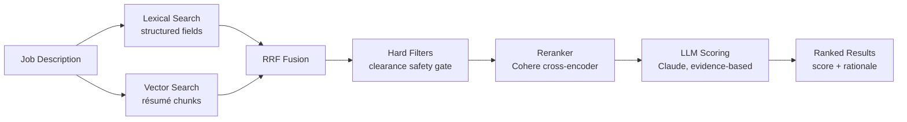

# Candidate Matching System

> How `POST /job-descriptions/{pk}/match` ranks candidates against a job description — the
> design, the reasoning behind each decision, and the experiments that validated them.
>
> **Audience:** written to be readable end-to-end by a non-technical stakeholder (the
> "plain-language" framing in each section), while giving engineers enough detail to reason
> about and extend the system (the "technical detail" that follows).

---

## 1. The problem, in plain language

Recruiters need to answer one question fast: *"Of everyone in our talent pool, who actually
fits this job?"* Doing that well is harder than it sounds:

- **Wording varies.** A résumé might say "Software Developer" where the job posting says
  "Software Engineer" — same job, different words. A naive keyword search misses this.
- **Some requirements are non-negotiable.** A required security clearance isn't a "nice to
  have" — a candidate without it should never be recommended, no matter how good their
  skills look on paper.
- **Cost matters.** Reading every résumé in full detail with an AI model for every search
  would be slow and expensive if the pool grows into the thousands.

The system solves this with a **retrieve → rerank → score** pipeline: cheaply narrow
thousands of candidates down to a shortlist using fast search techniques, then spend the
expensive, careful AI reasoning on only that small shortlist. This keeps quality high and
cost proportional to the shortlist size, not the size of the whole talent pool.

---

## 2. How it works



| Stage | What it does | Why |
|---|---|---|
| **Lexical search** | OpenSearch query against structured fields (`skill_names`, `job_title`, `industry_category`) with hard filters for clearance and minimum experience. | Fast, precise, and enforces hard requirements natively. Misses candidates whose résumé uses different wording than the JD. |
| **Vector search** | Embeds the JD's role signal and searches a k-NN index of résumé chunks by semantic similarity. | Recovers candidates the lexical leg misses because of wording differences (e.g. "Computer Scientist" for a "Software Engineer" role). |
| **RRF fusion** | Merges the two ranked lists using each candidate's *position* in each list (not raw scores, which aren't comparable across methods). | A candidate both methods agree on rises to the top; a candidate only one method found still gets a fair shot. |
| **Hard filters** | Re-applies the JD's non-negotiable requirements (clearance) to the *fused* candidate set. | The vector leg has no filter clause of its own — see [§6](#6-a-real-bug-we-found-and-fixed-the-clearance-safety-gate) for why this step exists and what happens without it. |
| **Reranker** | Cohere's cross-encoder model (via Bedrock) reads each candidate's full résumé side-by-side with the JD and reorders the set by genuine relevance. | Catches nuance that keyword/embedding matching alone misses — it's reading real text, not comparing vectors. |
| **LLM scoring** | Claude scores the top ~10 candidates against the JD using an evidence-based rubric, producing a 0-100 score and a rationale citing specific résumé content. | The only stage that reasons in natural language about *why* a candidate fits — reserved for a small, fixed-size shortlist so cost never scales with pool size. |

### 2.1 Two ways to search, fused together

**Lexical search** matches exact terms against structured candidate fields. It's precise and
enforces hard requirements (like clearance) directly in the query — but it's brittle to
wording. **Vector (semantic) search** embeds the job description and every résumé chunk into
the same numeric space and finds candidates by *meaning*: it can find "Software Developer"
for a "Software Engineer" search because their embeddings land close together, even though
the words differ.

Both run on every match request; their results are combined with **Reciprocal Rank Fusion
(RRF)**:

```python
def _rrf_order(lexical_pks, vector_pks, k=RRF_K):
    scores = {}
    for rank, pk in enumerate(lexical_pks):
        scores[pk] = scores.get(pk, 0) + 1.0 / (k + rank + 1)
    for rank, pk in enumerate(vector_pks):
        scores[pk] = scores.get(pk, 0) + 1.0 / (k + rank + 1)
    return sorted(scores, key=scores.get, reverse=True)
```

Each candidate accumulates `1 / (k + rank)` for every list they appear in (`k=60` is a
damping constant that keeps rank 1 vs. rank 2 close, while rank 1 vs. rank 50 stays far
apart). A candidate ranked #1 in *both* lists roughly doubles their score — agreement between
methods is rewarded — while a candidate found strongly by only one method still surfaces.
This is the mechanism, not raw score averaging, because a lexical `_score` and a vector
cosine-similarity aren't on the same scale and can't be compared directly.

RRF is used twice: once to fuse lexical + vector candidates, and again to blend the
reranker's reordering back with the pre-rerank fusion order — so a single bad reranker call
can only nudge the ranking, never wipe out a well-fused candidate entirely.

### 2.2 Chunking & embeddings

Résumés are split into fixed ~1,400-character windows with ~200-character overlap (the
overlap prevents losing context at a chunk boundary) and embedded with **Titan Text
Embeddings v2** (512 dimensions — half the memory of the full 1,024-dim model, which doesn't
matter at this candidate-pool scale). Each chunk is stored in a sibling OpenSearch index,
`talent-chunks`, alongside a `parent_pk` pointing back to the candidate. At query time, the
top-scoring chunk per candidate determines that candidate's vector-leg rank.

This is a simple, fixed-window chunking strategy (no attempt to respect sentence or section
boundaries) — good enough to power recall, with a known limitation that a chunk can split
mid-sentence or blend two résumé sections together.

### 2.3 The reranker

Before any candidate reaches the LLM, **Cohere Rerank 3.5** (via Bedrock) reads each
candidate's *full* résumé text side-by-side with the JD's focused role signal and produces a
single relevance score per candidate — a genuinely different mechanism from both lexical
matching and vector similarity (it's a cross-encoder: the model attends to the JD and résumé
jointly, rather than comparing two independently-computed representations). Its reordering is
blended back into the fusion order via RRF rather than replacing it outright.

One design detail mattered a lot in testing: **the reranker must read the same granularity of
text the LLM ultimately judges on.** Early on it was fed a thin résumé summary and made
results *worse* — its picks diverged from what the LLM (reading the full résumé) preferred.
Switching the reranker to read full résumé text (capped at 6,000 characters) fixed this; see
[§7](#7-experiments--results).

### 2.4 LLM scoring

The final shortlist (~10 candidates, chosen by the reranker) is scored by Claude against each
candidate's *full* résumé text — not a summary — with an evidence-based rubric:

| Rubric component | Points |
|---|---|
| Role & experience alignment (vs. the JD's responsibilities, not just its title) | 40 |
| Skills & certifications | 30 |
| Years of experience | 15 |
| Clearance, location & industry | 15 |

Every score comes with a rationale that cites specific résumé content — not just a number.
Scoring is parallelized (multiple concurrent Bedrock calls, small batches) so wall-clock time
stays roughly constant regardless of shortlist size, which matters because of the next
section.

### 2.5 The job description side

Early versions of the system queried against a thin, 500-character JD summary — the same
"lossy compression" problem that thin résumé summaries caused on the candidate side. The JD
extraction pipeline was enriched to also capture:

- **`jd_text`** — the full extracted JD text (mirrors `resume_text` on the candidate side).
- **`responsibilities[]`** — 3-8 distilled "what this role requires you to DO" statements.
  This turned out to be the single highest-signal field: résumé data describes what a
  candidate *did*, and responsibilities describe what the role *needs* — matching those
  directly is more reliable than matching job titles, which vary in wording across
  companies and industries.
- **`seniority`** and **`domain`** — explicit fields so the matcher doesn't have to infer
  career level or industry context from free text.

The vector query, the reranker query, and the LLM's scoring context all use this enriched
representation (`_jd_query_text` in the matcher code): job title + seniority + domain +
summary + responsibilities + skills.

---

## 3. Why job title isn't a hard requirement

An earlier version of the matcher capped a candidate's score if their job title didn't
closely match the JD's title, using simple text-similarity heuristics. That was removed: it
penalized candidates whose title genuinely differs from the JD's wording but who do the same
work (e.g. "Software Developer" vs. "Software Engineer" vs. "Computer Scientist" — often
functionally interchangeable). Instead:

- Job title is still stored, indexed, and shown to the LLM — it's a **positive signal**, just
  not a gate.
- Equivalence between differently-worded roles is now handled by matching against
  **responsibilities**, not titles (§2.5), and by the LLM's evidence-based rubric, which
  explicitly credits differently-worded but equivalent skills and experience.

---

## 4. Lookup-table query expansion (optional, off by default)

For a small precision boost, the matcher can ask an LLM to pick **canonical synonyms** from
the existing skills/job-title lookup tables (e.g. "Software Engineer" ⇄ "Software Developer",
"AWS" ⇄ "Amazon Web Services") and add those as extra structured-field search terms — never
matched against free-text résumé bodies, which would be noisy (it would boost incidental
keyword mentions, e.g. a résumé that says "the team used Python, but I wrote the Java
services").

This is deliberately **high-precision, narrow-scope**: only tight synonyms, not broad semantic
relatedness (that's what vector search and the LLM's own judgment are for). It's off by
default (`?expand=false`) because the measured quality benefit has been small and
inconsistent — see [§7](#7-experiments--results) — while it adds a full extra LLM call's
worth of latency and cost to every match.

---

## 5. Configuration reference

Each stage can be toggled per-request — used by the evaluation harness
(`scripts/eval_matching.py`) to measure each feature's individual contribution to quality and
cost.

```
?vector=true|false   # semantic résumé-chunk retrieval        (default: true)
?rerank=true|false   # Cohere cross-encoder reordering        (default: true)
?expand=true|false   # lookup-table synonym expansion         (default: false)
?limit=N             # number of ranked results to return      (default: 10)
```

Key environment variables (`infra/modules/api/lambda_src/match_candidates/app.py`):

| Variable | Default | Purpose |
|---|---|---|
| `BEDROCK_MODEL_ID` | `us.anthropic.claude-sonnet-4-6` | Scoring model (dedicated `match_model_id` Terraform var — separate from the résumé/JD extraction model). |
| `PRE_FILTER_LIMIT` | `50` | Candidates pulled from the lexical prefilter. |
| `SCORING_LIMIT` | `10` | Candidates sent to the LLM for scoring (fixed cost regardless of pool size). |
| `RESUME_CHARS_CAP` | `12000` | Résumé characters sent to the LLM per candidate (~3k tokens). |
| `KNN_CHUNK_HITS` / `VECTOR_CANDIDATES` | `100` / `50` | k-NN chunk hits pulled, and how many candidates the vector leg contributes. |
| `RERANK_INPUT` / `RERANK_CHARS_CAP` | `60` / `6000` | Candidates sent to the reranker, and résumé characters per reranked document. |
| `RERANK_DEFAULT` | `true` | Reranker on by default (see §7 for why). |
| `EXPAND_DEFAULT` | `false` | Query expansion off by default (see §7). |

Every match response includes a `telemetry` block — candidate counts per stage, LLM/embed
call counts, token usage, and latency — so quality and cost decisions can be made from
measurement, not assumption.

---

## 6. A real bug we found and fixed: the clearance safety gate

While validating the system against a real job description requiring an active security
clearance, we found that the **vector retrieval leg had no way to enforce hard requirements**
— unlike the lexical leg, which filters candidates by required clearance directly in its
OpenSearch query, the vector leg's k-NN search (`_vector_candidate_pks`) had no filter clause
at all. Reciprocal rank fusion could therefore pull a candidate who was strong on skills but
**did not hold the required clearance level** into the top of the merged, fused list — before
any hard-requirement check ran again.

**Concretely:** on a job description requiring a specific high-tier clearance, one candidate
had by far the closest title and skill match to the role, but held a lower clearance tier than
required. Retrieval configurations that used only vector search ranked this candidate #1 —
the semantic embedding of their résumé had no representation of the clearance requirement at
all, so it was invisible to that stage. Configurations that used the reranker happened to
catch it that particular time (the cross-encoder reads the JD's clearance text against the
résumé), but that's incidental — a cross-encoder relevance score is not a guaranteed
compliance gate, and a reranker failure or a different candidate mix could let it through.

**The fix:** the JD's clearance requirement is now re-applied to the *fully merged* candidate
set — after both lexical and vector legs have contributed, and before reranking or scoring —
regardless of which leg surfaced a given candidate:

```python
def _meets_hard_requirements(jd, candidate):
    required_clearance = jd.get("required_clearance")
    if required_clearance:
        req_rank = _clearance_rank(required_clearance)
        if req_rank >= 0 and _clearance_rank(candidate.get("clearance_level")) < req_rank:
            return False
    return True

# applied to the merged (lexical ∪ vector) candidate set, before reranking:
candidates = [c for c in candidates if _meets_hard_requirements(jd, c)]
```

Minimum years of experience is deliberately handled *differently* and was **not** added to
this hard gate: it's treated as a soft signal — an under-experienced candidate can still be
scored, but a separate deterministic guardrail caps how high their score can go, so they can't
out-rank a genuinely qualified candidate through keyword inflation alone. Clearance is
different in kind: it's a binary, non-negotiable eligibility requirement, not a matter of
degree.

This is covered by regression tests (`TestVectorLegRespectsClearanceGate` in
`infra/tests/unit/api/test_match_candidates.py`), including an end-to-end test confirming a
candidate surfaced *only* by the vector leg is stripped before ever reaching LLM scoring.

---

## 7. Experiments & Results

### 7.1 Methodology and its limits

Quality is measured as the **mean LLM score of the top-5 returned candidates**, averaged
across a fixed set of 10 real job descriptions, with each configuration run twice per JD and
averaged (LLM-as-judge scoring is noisy — the same candidate can score meaningfully
differently between runs, so single-JD, single-run deltas are not trustworthy; only
multi-run, multi-JD aggregates are). This is a proxy metric, not ground truth: it tells us
whether a change makes the *LLM's own judgment* more favorable, not whether it makes
*objectively better hiring decisions*. A true precision/recall measurement would need a
human-labeled golden set (a recruiter marking which candidates are actually good fits per
JD) — not built yet; see [§8](#8-known-limitations--future-work).

**A specific trap to avoid:** comparing the *new* system's absolute scores against the
*original* (pre-rebuild) matcher's absolute scores is not valid, even though both produce a
"0-100 score." They use different rubrics, and the original matcher had a scoring-inflation
bug (part of what this rebuild fixed) — on a job description where the candidate pool had
zero genuine matches, the original scored non-matching candidates 45-65 while the new system
correctly scored the same candidates 8-32. A *higher* average from the original matcher
reflects *worse* discrimination between good and bad fits, not better matching. The valid
comparison is always **within** the new system's own rubric — comparing configurations
against each other, not against the original.

### 7.2 Decision history (what we learned as the system was built)

These were the ablations run *during* development, each validating one decision at the time
it was made:

**Pre-JD-enrichment** (thin JD query — `description_summary` only):

| Arm | Quality | Δ |
|---|---|---|
| lexical only | 44.0 | — |
| + vector | 45.5 | +1.46 |
| + reranker | 45.4 | -0.10 |

Vector retrieval was a clear, cheap win. The reranker looked like a wash — reading a thin
JD summary, its picks didn't reliably improve on fusion order alone.

**Post-JD-enrichment** (rich JD query — `responsibilities[]` + full context, §2.5):

| Arm | Quality | Δ |
|---|---|---|
| lexical only | 39.4 | — |
| + vector | 40.2 | +0.72 |
| + reranker | 42.6 | **+2.46** |

Once the reranker had a rich query to work with, it became the single biggest lever — this is
why `RERANK_DEFAULT` was flipped back to `true`. (Absolute scores dropped between the two
tables above — that's confounded by JD re-extraction and a stricter rubric change alongside
metric noise, not a real regression; only the within-table deltas are meaningful.)

### 7.3 Final validated results (post clearance-fix, all 10 JDs, 2 runs each)

This is the authoritative comparison — run after the clearance safety-gate fix (§6), across
all 9 retrieval configurations (lexical / vector, each × reranker on/off × expansion on/off),
plus the original matcher for the inflation-artifact illustration:

```
=== ALL 10 JDs ===
config       quality   Δ vs lexical
vec+r          41.1      +2.8   ← deployed default
vec+r+e        40.8      +2.5
vec+e          39.8      +1.5
lex+r+e        39.5      +1.2
vec            39.2      +0.9
lex+e          39.0      +0.7
lex+r          38.8      +0.5
lex            38.3       —
```

**The clearance-fix specifically validated, isolated to the JDs it applies to:** 7 of the 10
JDs in the test set require a specific clearance level; the other 3 have no clearance
requirement (the fix is a documented no-op there — used as a sanity check that nothing else
drifted):

```
CLEARANCE-GATED JDs (7 of 10) — where the fix matters:
vec+r          38.6      +3.5 vs lexical    +3.2 vs vector-without-rerank
lex+r          34.8
vec            35.4
lex            35.1

NON-GATED JDs (3 of 10) — fix is a no-op, sanity check:
lex+r          48.1  (configs cluster within ~1.2 of each other — small sample, high noise)
vec+r          46.9
```

**This answers the key question directly: does the deployed default still win once the
clearance-disqualification distortion is removed?** Yes — on the clearance-gated subset
specifically, `vec+r` beats plain lexical search by **+3.5** and beats vector-without-reranker
by **+3.2**, a *larger* margin than the all-JD aggregate. The reranker's lift is bigger on
these harder, more specialized JDs (where a handful of genuinely qualified candidates need to
be distinguished from many superficially-similar ones) than on the easier, non-gated JDs. The
improvement is real, not an artifact of the bug we just fixed.

Query expansion (`+e`) remains the weakest, most inconsistent lever — it moves the needle by
less than a point in either direction depending on configuration, for the cost of a full
extra LLM call. It stays off by default.

**Per-feature summary (quality, cost, and the call made):**

| Feature | Quality Δ (all JDs) | Quality Δ (clearance-gated JDs) | Added cost/match | Verdict |
|---|---|---|---|---|
| Lexical search (baseline) | — | — | included in $0.12 base | Always on — fast, precise, enforces hard filters natively |
| + Vector retrieval | +0.9 | +0.3 | ~$0.0001 (1 embed call) | **On by default** — cheap, catches wording-mismatch candidates |
| + Reranker | +1.9 | **+3.2** | ~$0.002 (1 rerank call, ~60 docs) | **On by default** — biggest lever, especially on specialized/niche roles |
| + Query expansion | -0.3 | mixed, <±0.5 | ~$0.01 (1 extra LLM call) | **Off by default** — inconsistent benefit, real added cost/latency |

### 7.4 A concrete walk-through

To sanity-check the aggregate numbers against real candidates (not just LLM self-scores),
we ran all 9 configurations against a single job description with a strong, genuine candidate
pool — a "Data & Excel Analyst" role requiring an active high-tier clearance. Candidate names
are anonymized below (this repository is public); the underlying facts are real.

| Candidate | Holds required clearance? | Real fit for the role |
|---|---|---|
| **Candidate A** | ✅ | Best: exact skill match (data analysis, Excel, a desired BI tool) |
| Candidate B | ✅ | Good: has the core required skill, but missing the desired ones |
| Candidate C | ✅ | Weaker: has the required skill but none of the role's other signals |
| Candidate D | ❌ **fails the clearance requirement** | Closest title/skill match of anyone in the pool — but ineligible |

**What each configuration ranked #1**, before the clearance-gate fix:

- Lexical-based configurations correctly ranked **Candidate A** #1 (the genuinely best,
  eligible fit).
- Vector-only configurations ranked **Candidate D** #1 — the clearance-ineligible candidate —
  because vector search had no representation of the clearance requirement at all.
- Configurations that combined vector search with the reranker avoided recommending Candidate
  D (the reranker happened to catch the clearance mismatch by reading full résumé text
  against the JD), but landed on Candidate B, not the best-fit Candidate A.

After the clearance-gate fix, **Candidate D is excluded from every configuration**, and the
deployed default (vector + reranker) now correctly surfaces **Candidate A** — the genuinely
best, eligible candidate — as the top match. This single example is what motivated re-running
the full grid (§7.3) to confirm the fix's effect generalizes rather than being one JD's
coincidence.

### 7.5 Cost

Verified provider rates (2026-07-01):

| Component | Rate |
|---|---|
| Claude Sonnet 4.6 (scoring) | $3.00 / MTok input, $15.00 / MTok output |
| Cohere Rerank 3.5 | $2.00 / 1,000 search units (1 unit = 1 query + ≤100 doc chunks) |
| Titan Text Embeddings v2 | ~$0.02 / MTok (negligible at this scale) |

Measured per-match cost, deployed default (vector + reranker on, expansion off), from live
telemetry: ~28.5k input + ~2k output tokens for LLM scoring, ~60 documents to the reranker (1
search unit), 1 JD embedding call.

```
LLM scoring:      28,500 × $3/M  +  2,000 × $15/M   ≈ $0.086 + $0.030  = $0.116
Reranker:         1 search unit × $2/1,000                             = $0.002
JD embedding:     ~500 tokens × $0.02/M                                ≈ negligible
────────────────────────────────────────────────────────────────────────────────
Total:                                                                 ≈ $0.12 / match
```

**~95% of per-match cost is LLM scoring** — this is intentional: it's the one stage doing the
expensive natural-language reasoning, held to a small fixed shortlist (`SCORING_LIMIT=10`) so
cost never scales with talent-pool size. One-time embedding backfill for the full candidate
pool at the time of this build (128 candidates → 805 résumé chunks) cost roughly $0.006
total.

---

## 8. Known limitations & future work

- **No human-labeled golden set.** All quality numbers above are LLM-as-judge — they measure
  whether the *LLM's own opinion* improved, which is a reasonable proxy but not ground truth.
  A recruiter-labeled set of "actually good fits" per JD would enable real precision/recall
  measurement.
- **LLM-judge scoring is noisy.** The same candidate can score meaningfully differently
  between runs; only aggregates across multiple JDs and runs are trustworthy, never a
  single-JD, single-run delta.
- **Chunking is a simple fixed-window strategy.** It can split a résumé mid-sentence or blend
  two sections together. Good enough to drive recall; a smarter, structure-aware chunker is a
  future improvement, not a current problem.
- **API Gateway's 30-second hard timeout** (HTTP APIs cannot be configured beyond this,
  unlike REST APIs) sets a firm ceiling on total match latency. This is currently managed by
  parallelizing LLM scoring calls and keeping the scored shortlist small — there is limited
  remaining headroom if scoring is made more thorough per candidate.
- **Bedrock's daily token quota is a real operational risk — and it was hit during this
  build's own validation.** This AWS account's operative quota for Claude Sonnet 4.6 via the
  cross-region inference profile in use (`us.anthropic.claude-sonnet-4-6`) is **10.8M
  tokens/day** (AWS Service Quotas code `L-B29C9321`, base allowance 5.4M/day doubled for
  cross-region calls), and it is **not self-service adjustable** — a quota increase requires
  an AWS Support case. At ~30k tokens/match, that's a ceiling of roughly **360 matches/day**.
  The final validation grid for this write-up alone (180 invocations) accounts for about half
  of that; combined with the rest of this session's testing (earlier ablations, JD
  reprocessing, live spot-checks — all run the same day), cumulative usage crossed the
  ceiling and every scoring call began failing with `ThrottlingException: Too many tokens per
  day`. **This is not a code defect** — the same request would succeed once the quota clears
  — but it demonstrates the ceiling is easy to reach even in a single day of active
  testing, let alone real production traffic. It's unclear from the AWS API whether this
  resets on a rolling 24-hour window or a fixed calendar-day boundary; either way, recovery
  is not instant. **Recommendation: request a quota increase from AWS Support before any real
  production traffic, and add CloudWatch alerting on Bedrock `ThrottlingException` rates** so
  this is caught proactively rather than discovered as silent null scores and gateway
  timeouts.
- **The retry behavior makes this worse, and should be fixed — flagged here, not yet
  implemented.** `_converse_with_retry` retries every `ThrottlingException` with backoff
  (right for a transient per-minute throttle). But a *daily* token quota will not replenish
  within a few seconds of backoff — retrying into it just burns ~30-45 seconds before failing
  anyway, which is what pushes a request past the API Gateway's 30-second cap and turns a
  clean "throttled, try later" signal into an opaque gateway timeout for the user. The fix is
  to detect the "tokens per day" message specifically (distinct from the per-minute
  `ThrottlingException`) and fail fast with a clear error instead of retrying. Not
  implemented as part of this build because it cannot be tested while the quota is currently
  exhausted — verifying a scoring-path change blind, under the very failure condition it's
  meant to handle, risks introducing a real regression instead of fixing one.

---

## 9. Where things live

| Component | Location |
|---|---|
| Matcher Lambda | `infra/modules/api/lambda_src/match_candidates/app.py` |
| Matcher tests | `infra/tests/unit/api/test_match_candidates.py` |
| API wiring / env vars | `infra/modules/api/lambdas.tf`, `infra/modules/api/variables.tf` |
| Résumé chunking + embedding sync | `infra/modules/storage/lambda_src/sync_to_opensearch/app.py` |
| One-time embedding backfill | `scripts/backfill_embeddings.py` |
| JD extraction (schema/prompt/persist) | `infra/pipeline_configs/job_description/{schema.json,prompt.txt,persist/app.py}` |
| Ablation / evaluation harness | `scripts/eval_matching.py` |
| In-app technical reference | Help Center → Technical Reference → **Matching** tab (frontend) |
