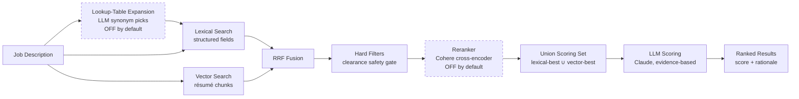

# Candidate Matching System

> How `POST /job-descriptions/{pk}/match` ranks candidates against a job description — the
> design, the reasoning behind each decision, and the experiments that validated them.
>
> **Audience:** written to be readable end-to-end by a non-technical stakeholder (the
> "plain-language" framing in each section), while giving engineers enough detail to reason
> about and extend the system (the "technical detail" that follows).

---

## 1. The problem, in plain language

Recruiters need to answer one question fast: *"Of everyone in our talent pool, who actually
fits this job?"* Doing that well is harder than it sounds:

- **Wording varies.** A résumé might say "Software Developer" where the job posting says
  "Software Engineer" — same job, different words. A naive keyword search misses this.
- **Some requirements are non-negotiable.** A required security clearance isn't a "nice to
  have" — a candidate without it should never be recommended, no matter how good their
  skills look on paper.
- **Cost matters.** Reading every résumé in full detail with an AI model for every search
  would be slow and expensive if the pool grows into the thousands.

The system solves this with a **retrieve → score** pipeline: cheaply narrow
thousands of candidates down to a shortlist using fast search techniques (lexical + semantic
retrieval), then spend the expensive, careful AI reasoning on only that small shortlist. This
keeps quality high and cost proportional to the shortlist size, not the size of the whole
talent pool. Two optional stages exist but are currently **off by default**: a cross-encoder
**reranker** for when the pool grows large enough to need it — see
[§2.3](#23-the-reranker-optional-off-by-default) and
[§7.6](#76-post-ship-recall-investigation-reranker-off--union-scoring) for why — and
**lookup-table query expansion**, which adds canonical synonyms to the lexical query but
measured out as too small and inconsistent a win for its cost ([§4](#4-lookup-table-query-expansion-optional-off-by-default)).

---

## 2. How it works



| Stage | What it does | Why |
|---|---|---|
| **Lookup-table expansion** *(optional, off by default)* | An LLM picks tight canonical synonyms for the JD's skills and job title from the existing lookup tables (e.g. "Software Engineer" ⇄ "Software Developer") and adds them as extra structured-field search terms for the lexical leg. | Recovers exact-synonym wording mismatches at the lexical stage without touching free-text résumé bodies. Measured benefit was small and inconsistent for the cost of an extra LLM call per match, so it is off by default ([§4](#4-lookup-table-query-expansion-optional-off-by-default)). |
| **Lexical search** | OpenSearch query against structured fields (`skill_names`, `job_title`, `industry_category`) with hard filters for clearance and minimum experience. | Fast, precise, and enforces hard requirements natively. Misses candidates whose résumé uses different wording than the JD. |
| **Vector search** | Embeds the JD's role signal and searches a k-NN index of résumé chunks by semantic similarity. | Recovers candidates the lexical leg misses because of wording differences (e.g. "Computer Scientist" for a "Software Engineer" role). |
| **RRF fusion** | Merges the two ranked lists using each candidate's *position* in each list (not raw scores, which aren't comparable across methods). | A candidate both methods agree on rises to the top; a candidate only one method found still gets a fair shot. |
| **Hard filters** | Re-applies the JD's non-negotiable requirements (clearance) to the *fused* candidate set. | The vector leg has no filter clause of its own — see [§6](#6-a-real-bug-we-found-and-fixed-the-clearance-safety-gate) for why this step exists and what happens without it. |
| **Reranker** *(optional, off by default)* | Cohere's cross-encoder model (via Bedrock) reads each candidate's full résumé side-by-side with the JD and reorders the set by genuine relevance. | A *scale* tool: valuable when retrieval returns far more candidates than can be LLM-scored. At the current pool size it added no recall and mis-ranked terse-résumé candidates, so it is off by default ([§7.6](#76-post-ship-recall-investigation-reranker-off--union-scoring)). |
| **Union scoring set** | Selects which candidates the LLM scores as the **union** of each retrieval leg's best (lexical-best ∪ vector-best), rather than the top-N of one blended ranking. | Guarantees a strong single-signal candidate still reaches the LLM — a great structured-skills match with a terse résumé, or a great semantic match worded differently from the skill tags. See [§2.4](#24-choosing-who-the-llm-scores-union-based-selection). |
| **LLM scoring** | Claude scores the shortlist (~12 candidates) against the JD using an evidence-based rubric, producing a 0-100 score and a rationale citing specific résumé content. | The only stage that reasons in natural language about *why* a candidate fits — reserved for a small, fixed-size shortlist so cost never scales with pool size. It is the real precision judge. |

### 2.0 What actually runs today (the deployed default)

The diagram and table above show every stage the system *has*, including the two optional
ones. Stripped to what a real match request executes with default settings, the live pipeline
is:

1. **Build the enriched JD query** (`_jd_query_text`, [§2.6](#26-the-job-description-side)) —
   job title + seniority + domain + summary + responsibilities + skills.
2. **Lexical search** against structured candidate fields, with clearance and
   minimum-experience filters applied natively in the query.
3. **Vector search** — embed the JD query and k-NN the résumé-chunk index
   ([§2.2](#22-chunking--embeddings)); the top chunk per candidate sets their vector rank.
4. **RRF fusion** of the two ranked lists ([§2.1](#21-two-ways-to-search-fused-together)) —
   this fused order is what determines the returned display order.
5. **Clearance safety gate** re-applied to the merged set
   ([§6](#6-a-real-bug-we-found-and-fixed-the-clearance-safety-gate)).
6. **Union selection** of the scoring shortlist ([§2.4](#24-choosing-who-the-llm-scores-union-based-selection)):
   8 lexical-best slots + 4 reserved vector-only slots = 12 candidates (`SCORING_LIMIT`).
7. **LLM scoring** — Claude scores all 12 against the full résumé in a single concurrent wave
   (~15s, ~$0.12/match), and those scores decide the final ranking returned to the user.

**Not in this path:** the reranker ([§2.3](#23-the-reranker-optional-off-by-default)) and
lookup-table expansion ([§4](#4-lookup-table-query-expansion-optional-off-by-default)) are both
implemented and available per request (`?rerank=true`, `?expand=true`) but off by default —
the reranker until the pool outgrows what retrieval + LLM scoring handle directly, and
expansion because its measured benefit didn't justify an extra LLM call per match.

### 2.1 Two ways to search, fused together

**Lexical search** matches exact terms against structured candidate fields. It's precise and
enforces hard requirements (like clearance) directly in the query — but it's brittle to
wording. **Vector (semantic) search** embeds the job description and every résumé chunk into
the same numeric space and finds candidates by *meaning*: it can find "Software Developer"
for a "Software Engineer" search because their embeddings land close together, even though
the words differ.

Both run on every match request; their results are combined with **Reciprocal Rank Fusion
(RRF)**:

```python
def _rrf_order(lexical_pks, vector_pks, k=RRF_K):
    scores = {}
    for rank, pk in enumerate(lexical_pks):
        scores[pk] = scores.get(pk, 0) + 1.0 / (k + rank + 1)
    for rank, pk in enumerate(vector_pks):
        scores[pk] = scores.get(pk, 0) + 1.0 / (k + rank + 1)
    return sorted(scores, key=scores.get, reverse=True)
```

Each candidate accumulates `1 / (k + rank)` for every list they appear in (`k=60` is a
damping constant that keeps rank 1 vs. rank 2 close, while rank 1 vs. rank 50 stays far
apart). A candidate ranked #1 in *both* lists roughly doubles their score — agreement between
methods is rewarded — while a candidate found strongly by only one method still surfaces.
This is the mechanism, not raw score averaging, because a lexical `_score` and a vector
cosine-similarity aren't on the same scale and can't be compared directly.

RRF fuses the lexical + vector candidate lists into one ranked set. When the reranker is
enabled (it is off by default — [§2.3](#23-the-reranker-optional-off-by-default)), RRF is used
a second time to blend the reranker's reordering back with the pre-rerank fusion order — so a
single bad reranker call can only nudge the ranking, never wipe out a well-fused candidate
entirely. Note that the fused *order* determines the returned display order, but which
candidates get LLM-scored is decided by union selection, not by taking the top-N of this fused
list — see [§2.4](#24-choosing-who-the-llm-scores-union-based-selection).

### 2.2 Chunking & embeddings

Résumés are split into fixed ~1,400-character windows with ~200-character overlap (the
overlap prevents losing context at a chunk boundary) and embedded with **Titan Text
Embeddings v2** (512 dimensions — half the memory of the full 1,024-dim model, which doesn't
matter at this candidate-pool scale). Each chunk is stored in a sibling OpenSearch index,
`talent-chunks`, alongside a `parent_pk` pointing back to the candidate. At query time, the
top-scoring chunk per candidate determines that candidate's vector-leg rank.

This is a simple, fixed-window chunking strategy (no attempt to respect sentence or section
boundaries) — good enough to power recall, with a known limitation that a chunk can split
mid-sentence or blend two résumé sections together.

### 2.3 The reranker (optional, off by default)

**Cohere Rerank 3.5** (via Bedrock) is a cross-encoder: it reads each candidate's full résumé
text side-by-side with the JD's focused role signal and produces a single relevance score per
candidate — a genuinely different mechanism from both lexical matching and vector similarity
(the model attends to the JD and résumé jointly, rather than comparing two
independently-computed representations). When enabled, its reordering is blended back into the
fusion order via RRF rather than replacing it outright.

**It is off by default at the current scale**, and understanding why is important:

- A reranker's real value is as a *scale* tool — cheaply ordering a large retrieved set
  (hundreds to thousands) so the expensive LLM only scores the genuine top few. At the current
  pool size (~128 candidates), retrieval already surfaces essentially everyone relevant, and
  the LLM — which reads both the structured skills *and* the full résumé — is the real
  precision judge. The reranker had no recall to add.
- Worse, it *mis-ranked* on this corpus. The reranker scores `job_title + resume_text` only —
  it is **blind to the structured `skill_names`** — so it over-rewards long, keyword-rich
  résumé prose and under-rewards terse résumés even when they are a perfect structured-skill
  match. On a live "Data Analyst" query it ranked a candidate holding *all three* required
  skills (but a short résumé) at #13, below the scoring cut, while a candidate with only one of
  the skills but a long finance résumé topped the list. Adding the structured skills into the
  reranker document barely moved the result (a few hundred characters against ~6,000 of prose).
  Full investigation: [§7.6](#76-post-ship-recall-investigation-reranker-off--union-scoring).

An earlier design note still holds and is why, *if* re-enabled, it reads full résumé text
(capped at 6,000 characters) rather than a thin summary: **the reranker must read the same
granularity of text the LLM ultimately judges on**, or its picks diverge from the LLM's.

Re-enable per request with `?rerank=true`, or globally by setting `RERANK_DEFAULT=true` — the
right move once the pool grows large enough that retrieval returns far more candidates than
`SCORING_LIMIT`.

### 2.4 Choosing who the LLM scores: union-based selection

The retrieval legs decide *which* candidates are worth the expensive LLM scoring. Rather than
taking the top-N of one blended RRF ranking, the matcher scores the **union of each leg's
best**: the top of the lexical order *plus* a reserved allocation for vector-only candidates,
backfilled with more lexical to fill the budget (`_union_score_pks` in the matcher).

```python
# budget = SCORING_LIMIT (12); vec_reserve = VEC_SCORE_SLOTS (4)
lex_slots = budget - vec_reserve          # 8 guaranteed lexical slots
chosen    = lexical_best[:lex_slots]
chosen   += up_to(vec_reserve) vector-only candidates not already chosen
chosen   += backfill from remaining lexical up to budget
```

Why this and not the top-N of the fused ranking: RRF gives a candidate `1/(k+rank)` **per list
they appear in**, so a candidate present in *both* legs gets ~double weight and can push a
strong *single-leg* candidate below the scoring cut. That is exactly what buried the
data-skilled candidate above — strong lexically (all three skills) but, with a terse résumé,
absent from the vector leg's top set, so the fused ranking demoted him out of scoring
entirely. Union selection guarantees each leg's best reach the LLM: **the vector leg can only
*add* recall, never demote a strong lexical (structured-skill) match out of scoring**, and vice
versa. The LLM's scores then decide the final rank. See
[§7.6](#76-post-ship-recall-investigation-reranker-off--union-scoring) for the before/after
recall measurement.

### 2.5 LLM scoring

The shortlist selected above (~12 candidates) is scored by Claude against each
candidate's *full* résumé text — not a summary — with an evidence-based rubric:

| Rubric component | Points |
|---|---|
| Role & experience alignment (vs. the JD's responsibilities, not just its title) | 40 |
| Skills & certifications | 30 |
| Years of experience | 15 |
| Clearance, location & industry | 15 |

Every score comes with a rationale that cites specific résumé content — not just a number.
Scoring is parallelized (multiple concurrent Bedrock calls, small batches) so wall-clock time
stays roughly constant regardless of shortlist size, which matters because of the next
section.

### 2.6 The job description side

Early versions of the system queried against a thin, 500-character JD summary — the same
"lossy compression" problem that thin résumé summaries caused on the candidate side. The JD
extraction pipeline was enriched to also capture:

- **`jd_text`** — the full extracted JD text (mirrors `resume_text` on the candidate side).
- **`responsibilities[]`** — 3-8 distilled "what this role requires you to DO" statements.
  This turned out to be the single highest-signal field: résumé data describes what a
  candidate *did*, and responsibilities describe what the role *needs* — matching those
  directly is more reliable than matching job titles, which vary in wording across
  companies and industries.
- **`seniority`** and **`domain`** — explicit fields so the matcher doesn't have to infer
  career level or industry context from free text.

The vector query, the reranker query, and the LLM's scoring context all use this enriched
representation (`_jd_query_text` in the matcher code): job title + seniority + domain +
summary + responsibilities + skills.

---

## 3. Why lexical matching never gates the score (title *or* skills)

Deterministic score caps enforce **facts** — clearance rank and years of experience — and
nothing else. Two earlier lexical guardrails were removed because they mechanically punished
good candidates for wording, which is exactly the judgment the LLM should make from the résumé:

**The job-title cap.** An earlier version capped a candidate's score if their job title didn't
closely match the JD's title (text-similarity heuristics). It penalized candidates whose title
genuinely differs from the JD's wording but who do the same work ("Software Developer" vs.
"Software Engineer" vs. "Computer Scientist" — often functionally interchangeable). Removed.

**The missing-required-skills cap.** A later-discovered instance of the same bug: the matcher
counted how many of the JD's required skills were absent from the candidate's *extracted skill
tags* and capped the score to "partial" (≤65 for 2+, ≤78 for 1). Because JDs list granular
sub-skills that are rarely all extracted as literal tags, this capped *every* strong candidate.
A real example: a 25-year Senior Systems Engineer was force-capped to "partial" as "missing"
Trade Studies, Functional Analysis, V&V, etc. — none of which any candidate's tags would ever
spell out in full. Removed; the lexical helpers it relied on were deleted.

In both cases:
- Job title and skills are still stored, indexed, and shown to the LLM — they're **positive
  signals**, just not gates.
- Equivalence between differently-worded roles/skills is handled by matching against
  **responsibilities**, not titles (§2.6), and by the LLM's evidence-based rubric, which
  explicitly credits differently-worded but equivalent skills and experience. Validated by
  hand: on a "Senior Systems Engineer" (GEOINT) JD, the LLM correctly scored a candidate
  titled "Systems Engineer" as 58/partial by reading past the title collision — his actual work
  is IT operations / config management, not the JD's GEOINT SE methodology.

**Frontend note.** The Match Insights panel previously showed removed-from-consideration skills
as red "Missing skill: X" chips computed the same lexical way — which *looked* authoritative and
misrepresented good candidates. It now shows amber "Not in tags: X" chips with a caption
clarifying the exact skill isn't in the candidate's extracted tags (the résumé may still
demonstrate it) and that the AI score is based on the full résumé, not these tags.

---

## 4. Lookup-table query expansion (optional, off by default)

For a small precision boost, the matcher can ask an LLM to pick **canonical synonyms** from
the existing skills/job-title lookup tables (e.g. "Software Engineer" ⇄ "Software Developer",
"AWS" ⇄ "Amazon Web Services") and add those as extra structured-field search terms — never
matched against free-text résumé bodies, which would be noisy (it would boost incidental
keyword mentions, e.g. a résumé that says "the team used Python, but I wrote the Java
services").

This is deliberately **high-precision, narrow-scope**: only tight synonyms, not broad semantic
relatedness (that's what vector search and the LLM's own judgment are for). It's off by
default (`?expand=false`) because the measured quality benefit has been small and
inconsistent — see [§7](#7-experiments--results) — while it adds a full extra LLM call's
worth of latency and cost to every match.

---

## 5. Configuration reference

Each stage can be toggled per-request — used by the evaluation harness
(`scripts/eval_matching.py`) to measure each feature's individual contribution to quality and
cost.

```
?vector=true|false   # semantic résumé-chunk retrieval        (default: true)
?rerank=true|false   # Cohere cross-encoder reordering        (default: true)
?expand=true|false   # lookup-table synonym expansion         (default: false)
?limit=N             # number of ranked results to return      (default: 10)
```

Key environment variables (`infra/modules/api/lambda_src/match_candidates/app.py`):

| Variable | Default | Purpose |
|---|---|---|
| `BEDROCK_MODEL_ID` | `us.anthropic.claude-sonnet-4-6` | Scoring model (dedicated `match_model_id` Terraform var — separate from the résumé/JD extraction model). |
| `PRE_FILTER_LIMIT` | `50` | Candidates pulled from the lexical prefilter. |
| `SCORING_LIMIT` | `12` | Candidates sent to the LLM for scoring (fixed cost regardless of pool size). Selected by union of retrieval legs — see §2.4. |
| `VEC_SCORE_SLOTS` | `4` | Of the `SCORING_LIMIT` budget, slots reserved for vector-only candidates so the semantic leg can *add* recall without displacing strong lexical matches (§2.4). |
| `RESUME_CHARS_CAP` | `12000` | Résumé characters sent to the LLM per candidate (~3k tokens). |
| `KNN_CHUNK_HITS` / `VECTOR_CANDIDATES` | `100` / `50` | k-NN chunk hits pulled, and how many candidates the vector leg contributes. |
| `RERANK_INPUT` / `RERANK_CHARS_CAP` | `60` / `6000` | Candidates sent to the reranker (when enabled), and résumé characters per reranked document. |
| `RERANK_DEFAULT` | `false` | Reranker **off** by default at the current pool size — added no recall and mis-ranked terse-résumé candidates (see §2.3 and §7.6). Set `true` (or `?rerank=true`) once the pool is large enough to need scale-time reordering. |
| `EXPAND_DEFAULT` | `false` | Query expansion off by default (see §7). |

Every match response includes a `telemetry` block — candidate counts per stage, the
`score_set_size` (how many candidates the union selection sent to the LLM), LLM/embed call
counts, token usage, and latency — so quality and cost decisions can be made from measurement,
not assumption.

---

## 6. A real bug we found and fixed: the clearance safety gate

While validating the system against a real job description requiring an active security
clearance, we found that the **vector retrieval leg had no way to enforce hard requirements**
— unlike the lexical leg, which filters candidates by required clearance directly in its
OpenSearch query, the vector leg's k-NN search (`_vector_candidate_pks`) had no filter clause
at all. Reciprocal rank fusion could therefore pull a candidate who was strong on skills but
**did not hold the required clearance level** into the top of the merged, fused list — before
any hard-requirement check ran again.

**Concretely:** on a job description requiring a specific high-tier clearance, one candidate
had by far the closest title and skill match to the role, but held a lower clearance tier than
required. Retrieval configurations that used only vector search ranked this candidate #1 —
the semantic embedding of their résumé had no representation of the clearance requirement at
all, so it was invisible to that stage. Configurations that used the reranker happened to
catch it that particular time (the cross-encoder reads the JD's clearance text against the
résumé), but that's incidental — a cross-encoder relevance score is not a guaranteed
compliance gate, and a reranker failure or a different candidate mix could let it through.

**The fix:** the JD's clearance requirement is now re-applied to the *fully merged* candidate
set — after both lexical and vector legs have contributed, and before reranking or scoring —
regardless of which leg surfaced a given candidate:

```python
def _meets_hard_requirements(jd, candidate):
    required_clearance = jd.get("required_clearance")
    if required_clearance:
        req_rank = _clearance_rank(required_clearance)
        if req_rank >= 0 and _clearance_rank(candidate.get("clearance_level")) < req_rank:
            return False
    return True

# applied to the merged (lexical ∪ vector) candidate set, before reranking:
candidates = [c for c in candidates if _meets_hard_requirements(jd, c)]
```

Minimum years of experience is deliberately handled *differently* and was **not** added to
this hard gate: it's treated as a soft signal — an under-experienced candidate can still be
scored, but a separate deterministic guardrail caps how high their score can go, so they can't
out-rank a genuinely qualified candidate through keyword inflation alone. Clearance is
different in kind: it's a binary, non-negotiable eligibility requirement, not a matter of
degree.

This is covered by regression tests (`TestVectorLegRespectsClearanceGate` in
`infra/tests/unit/api/test_match_candidates.py`), including an end-to-end test confirming a
candidate surfaced *only* by the vector leg is stripped before ever reaching LLM scoring.

---

## 7. Experiments & Results

> **Update — post-ship (read [§7.6](#76-post-ship-recall-investigation-reranker-off--union-scoring) first).**
> §7.2–§7.5 below are the *development-era* experiments, and two of their conclusions were
> later reversed by a recall-focused investigation using a **human-labeled golden set**: the
> reranker is now **off by default** (§2.3), and the scored shortlist is chosen by **union
> selection**, not the top-N of the fused ranking (§2.4). The mean-LLM-score methodology in
> §7.1 is also now understood to be invalid for comparing *configurations* (see §7.6). The
> sections are kept as decision-history; where they say the reranker is the deployed default,
> that is historical.

### 7.1 Methodology and its limits

Quality is measured as the **mean LLM score of the top-5 returned candidates**, averaged
across a fixed set of 10 real job descriptions, with each configuration run twice per JD and
averaged (LLM-as-judge scoring is noisy — the same candidate can score meaningfully
differently between runs, so single-JD, single-run deltas are not trustworthy; only
multi-run, multi-JD aggregates are). This is a proxy metric, not ground truth: it tells us
whether a change makes the *LLM's own judgment* more favorable, not whether it makes
*objectively better hiring decisions*. A recruiter-labeled golden set was later built to
measure recall@k directly — the correct way to compare configurations — see
[§7.6](#76-post-ship-recall-investigation-reranker-off--union-scoring) and
[§8](#8-known-limitations--future-work).

**A specific trap to avoid:** comparing the *new* system's absolute scores against the
*original* (pre-rebuild) matcher's absolute scores is not valid, even though both produce a
"0-100 score." They use different rubrics, and the original matcher had a scoring-inflation
bug (part of what this rebuild fixed) — on a job description where the candidate pool had
zero genuine matches, the original scored non-matching candidates 45-65 while the new system
correctly scored the same candidates 8-32. A *higher* average from the original matcher
reflects *worse* discrimination between good and bad fits, not better matching. The valid
comparison is always **within** the new system's own rubric — comparing configurations
against each other, not against the original.

### 7.2 Decision history (what we learned as the system was built)

These were the ablations run *during* development, each validating one decision at the time
it was made:

**Pre-JD-enrichment** (thin JD query — `description_summary` only):

| Arm | Quality | Δ |
|---|---|---|
| lexical only | 44.0 | — |
| + vector | 45.5 | +1.46 |
| + reranker | 45.4 | -0.10 |

Vector retrieval was a clear, cheap win. The reranker looked like a wash — reading a thin
JD summary, its picks didn't reliably improve on fusion order alone.

**Post-JD-enrichment** (rich JD query — `responsibilities[]` + full context, §2.6):

| Arm | Quality | Δ |
|---|---|---|
| lexical only | 39.4 | — |
| + vector | 40.2 | +0.72 |
| + reranker | 42.6 | **+2.46** |

Once the reranker had a rich query to work with, it became the single biggest lever in this
mean-score metric — which is why `RERANK_DEFAULT` was set to `true` at the time. This
conclusion was **later reversed** (§7.6): the mean-score metric rewarded the reranker for
surfacing long, keyword-rich résumés, which is not the same as better recall of genuinely
qualified candidates. (Absolute scores dropped between the two tables above — that's confounded
by JD re-extraction and a stricter rubric change alongside metric noise, not a real
regression; only the within-table deltas are meaningful.)

### 7.3 Final validated results (post clearance-fix, all 10 JDs, 2 runs each)

This is the authoritative comparison — run after the clearance safety-gate fix (§6), across
all 9 retrieval configurations (lexical / vector, each × reranker on/off × expansion on/off),
plus the original matcher for the inflation-artifact illustration:

```
=== ALL 10 JDs ===
config       quality   Δ vs lexical
vec+r          41.1      +2.8   ← deployed default
vec+r+e        40.8      +2.5
vec+e          39.8      +1.5
lex+r+e        39.5      +1.2
vec            39.2      +0.9
lex+e          39.0      +0.7
lex+r          38.8      +0.5
lex            38.3       —
```

**The clearance-fix specifically validated, isolated to the JDs it applies to:** 7 of the 10
JDs in the test set require a specific clearance level; the other 3 have no clearance
requirement (the fix is a documented no-op there — used as a sanity check that nothing else
drifted):

```
CLEARANCE-GATED JDs (7 of 10) — where the fix matters:
vec+r          38.6      +3.5 vs lexical    +3.2 vs vector-without-rerank
lex+r          34.8
vec            35.4
lex            35.1

NON-GATED JDs (3 of 10) — fix is a no-op, sanity check:
lex+r          48.1  (configs cluster within ~1.2 of each other — small sample, high noise)
vec+r          46.9
```

**This answers the key question directly: does the deployed default still win once the
clearance-disqualification distortion is removed?** Yes — on the clearance-gated subset
specifically, `vec+r` beats plain lexical search by **+3.5** and beats vector-without-reranker
by **+3.2**, a *larger* margin than the all-JD aggregate. The reranker's lift is bigger on
these harder, more specialized JDs (where a handful of genuinely qualified candidates need to
be distinguished from many superficially-similar ones) than on the easier, non-gated JDs. The
improvement is real, not an artifact of the bug we just fixed.

Query expansion (`+e`) remains the weakest, most inconsistent lever — it moves the needle by
less than a point in either direction depending on configuration, for the cost of a full
extra LLM call. It stays off by default.

**Per-feature summary (quality, cost, and the call made):**

| Feature | Quality Δ (all JDs) | Quality Δ (clearance-gated JDs) | Added cost/match | Verdict |
|---|---|---|---|---|
| Lexical search (baseline) | — | — | included in $0.12 base | Always on — fast, precise, enforces hard filters natively |
| + Vector retrieval | +0.9 | +0.3 | ~$0.0001 (1 embed call) | **On by default** — cheap, catches wording-mismatch candidates |
| + Reranker | +1.9 | **+3.2** | ~$0.002 (1 rerank call, ~60 docs) | *Was* on by default on this metric; **now off** — the metric over-credited it and it hurt recall of terse-résumé matches (§7.6). Kept behind `?rerank=true` for scale. |
| + Query expansion | -0.3 | mixed, <±0.5 | ~$0.01 (1 extra LLM call) | **Off by default** — inconsistent benefit, real added cost/latency |

### 7.4 A concrete walk-through

To sanity-check the aggregate numbers against real candidates (not just LLM self-scores),
we ran all 9 configurations against a single job description with a strong, genuine candidate
pool — a "Data & Excel Analyst" role requiring an active high-tier clearance. Candidate names
are anonymized below (this repository is public); the underlying facts are real.

| Candidate | Holds required clearance? | Real fit for the role |
|---|---|---|
| **Candidate A** | ✅ | Best: exact skill match (data analysis, Excel, a desired BI tool) |
| Candidate B | ✅ | Good: has the core required skill, but missing the desired ones |
| Candidate C | ✅ | Weaker: has the required skill but none of the role's other signals |
| Candidate D | ❌ **fails the clearance requirement** | Closest title/skill match of anyone in the pool — but ineligible |

**What each configuration ranked #1**, before the clearance-gate fix:

- Lexical-based configurations correctly ranked **Candidate A** #1 (the genuinely best,
  eligible fit).
- Vector-only configurations ranked **Candidate D** #1 — the clearance-ineligible candidate —
  because vector search had no representation of the clearance requirement at all.
- Configurations that combined vector search with the reranker avoided recommending Candidate
  D (the reranker happened to catch the clearance mismatch by reading full résumé text
  against the JD), but landed on Candidate B, not the best-fit Candidate A.

After the clearance-gate fix, **Candidate D is excluded from every configuration**, and the
system (vector on, reranker off per §7.6) now correctly surfaces **Candidate A** — the
genuinely best, eligible candidate — as the top match. This single example is what motivated
re-running the full grid (§7.3) to confirm the fix's effect generalizes rather than being one
JD's coincidence. (This is the same "Data & Excel Analyst" JD whose recall regression later
drove the reranker-off + union-scoring fixes in §7.6.)

### 7.5 Cost

Verified provider rates (2026-07-01):

| Component | Rate |
|---|---|
| Claude Sonnet 4.6 (scoring) | $3.00 / MTok input, $15.00 / MTok output |
| Cohere Rerank 3.5 | $2.00 / 1,000 search units (1 unit = 1 query + ≤100 doc chunks) |
| Titan Text Embeddings v2 | ~$0.02 / MTok (negligible at this scale) |

Measured per-match cost, current default (vector on, reranker off, expansion off), from live
telemetry: ~28.5k input + ~2k output tokens for LLM scoring across a ~12-candidate shortlist,
1 JD embedding call. The reranker is off by default, so its ~$0.002/match does not apply
unless re-enabled with `?rerank=true`.

```
LLM scoring:      28,500 × $3/M  +  2,000 × $15/M   ≈ $0.086 + $0.030  = $0.116
Reranker:         off by default (≈ $0.002/match when enabled)         = $0.000
JD embedding:     ~500 tokens × $0.02/M                                ≈ negligible
────────────────────────────────────────────────────────────────────────────────
Total:                                                                 ≈ $0.12 / match
```

**~95%+ of per-match cost is LLM scoring** — this is intentional: it's the one stage doing the
expensive natural-language reasoning, held to a small fixed shortlist (`SCORING_LIMIT=12`) so
cost never scales with talent-pool size. One-time embedding backfill for the full candidate
pool at the time of this build (128 candidates → 805 résumé chunks) cost roughly $0.006
total.

### 7.6 Post-ship recall investigation (reranker off + union scoring)

A live "Data & Excel Analyst" query surfaced the wrong #1: a Finance Manager holding only one
of the three required skills (but a long, keyword-rich résumé) topped the list, while a
candidate holding **all three** required skills — Data Analysis, Power BI, Microsoft Excel —
sat at **#13, below the scoring cut**, because his résumé was terse. This is exactly the kind
of error the mean-LLM-score metric (§7.1) is blind to, so the investigation switched to
**recall@k against human-labeled expected winners** — the correct way to compare
configurations. Two independent causes were found and fixed:

**Finding A — the reranker was mis-ranking, not adding recall.** Cohere Rerank scores
`job_title + resume_text` only; it never sees the structured `skill_names`, so it over-rewards
long résumé prose. Ablations (`?rerank=` toggle) showed: pure lexical ranked the data-skilled
candidate #1; lexical+vector ranked him #1; **adding the reranker dropped him to #13** and
floated the long-résumé Finance Manager to #1. Injecting the structured skills into the rerank
document barely moved him (a few hundred characters against ~6,000 of prose: #34 → #28 in the
full pool). At ~128 candidates the reranker had no recall to add and actively hurt, so
`RERANK_DEFAULT` was set to **`false`** (§2.3). Turning it off immediately put the data-skilled
candidate back at #1 (78) live.

**Finding B — equal-weight RRF diluted strong single-leg candidates.** Even with the reranker
off, a golden-set run showed **+vector scoring *worse* than lexical alone** (must-tier
recall@10 fell to ~71% from ~88%). Cause: RRF awards `1/(k+rank)` *per list a candidate appears
in*, so a candidate in **both** legs gets ~2× weight and can push a strong **single-leg**
candidate below the scoring cut. Taking the top-N of that fused ranking therefore dropped
skill-perfect-but-terse candidates out of scoring entirely. Fix: score the **union** of each
leg's best (`_union_score_pks`, §2.4) with `VEC_SCORE_SLOTS=4` reserved for vector-only recall,
and bump `SCORING_LIMIT` 10 → 12. Re-running the golden eval, must-tier +vector recovered to
88% (ties lexical — dilution eliminated) with clean semantic recoveries (e.g. one expected
candidate moved lexical #12 → +vector #5). The honest status: **vector no longer hurts**, and
on the current draft (lexical-leaning) labels it is roughly neutral-to-positive; the clearest
win is on wording-mismatch JDs. The reranker stays available behind `?rerank=true` for when the
pool grows large enough to need scale-time reordering.

**Finding C — full-budget requests were tripping the 30s gateway cap (503s).** With
`SCORING_LIMIT=12` and batches of 2, scoring produced 6 Bedrock calls but the pool ran only 5
concurrently, so a straggler 6th batch ran in a **second wave** and pushed full-budget requests
to ~30.7s — over API Gateway's hard 30s cap, surfacing as a frontend **503**. Fix: size the
worker pool to `ceil(SCORING_LIMIT / SCORING_BATCH)` so every batch runs in a **single
concurrent wave**. A full 12-candidate score now completes in ~15s live (6 concurrent calls,
one wave), well under the cap, with no change to cost or recall.

**Tooling:** `scripts/eval_golden.py` + `scripts/golden_set.json` provide the recall@k harness
(arms: `lexical`, `+vector`, `+rerank`; `--sleep` spacing to avoid Bedrock daily-quota
throttling noise, which otherwise shows up as spurious unscored "misses"). The golden labels
are recruiter-reviewable and currently lean lexical — see §8.

---

## 8. Known limitations & future work

- **Golden set exists but labels are still draft.** `scripts/golden_set.json` gives 5
  recruiter-style JDs with must/should-tier expected winners, and `scripts/eval_golden.py`
  measures recall@k against them — the correct metric for comparing configurations. The labels
  currently lean lexical, so on this set vector reads roughly neutral; expanding the set and
  correcting labels (especially adding genuine wording-mismatch winners) would give vector a
  fairer test and sharpen the config comparison.
- **Graded semantic scoring on the lookup tables (from a user idea).** Skill matching is
  effectively binary today — the lexical leg matches literal `skill_names` (Phase 2b synonym
  expansion is also binary), and all graded relatedness is left to the LLM scorer. A middle
  ground is to run semantic similarity over the skills/titles **lookup tables** and give a
  *graded* score to related-but-not-exact skills, feeding it as a **weighted `should` clause**
  into the prefilter. Detailed design, motivation, and risks in
  [§8.1](#81-graded-semantic-skill-matching-on-the-lookup-tables-proposal).
- **Chunking is a simple fixed-window strategy.** It can split a résumé mid-sentence or blend
  two sections together. Good enough to drive recall; a smarter, structure-aware chunker is a
  future improvement, not a current problem.
- **API Gateway's 30-second hard timeout** (HTTP APIs cannot be configured beyond this,
  unlike REST APIs) sets a firm ceiling on total match latency. This is managed by
  parallelizing LLM scoring into a **single concurrent wave** (worker pool sized to
  `ceil(SCORING_LIMIT / SCORING_BATCH)`, §7.6 Finding C) and keeping the scored shortlist
  small — a full 12-candidate score lands at ~15s. Headroom is finite: making per-candidate
  scoring more thorough (larger résumé cap, bigger batches) or raising `SCORING_LIMIT` past
  what fits one wave will push back toward the cap. If it bites again, dial `SCORING_LIMIT`
  back or reduce `RESUME_CHARS_CAP` before adding scoring depth.
- **Bedrock's daily token quota is a real operational risk — and it was hit during this
  build's own validation.** This AWS account's operative quota for Claude Sonnet 4.6 via the
  cross-region inference profile in use (`us.anthropic.claude-sonnet-4-6`) is **10.8M
  tokens/day** (AWS Service Quotas code `L-B29C9321`, base allowance 5.4M/day doubled for
  cross-region calls), and it is **not self-service adjustable** — a quota increase requires
  an AWS Support case. At ~30k tokens/match, that's a ceiling of roughly **360 matches/day**.
  The final validation grid for this write-up alone (180 invocations) accounts for about half
  of that; combined with the rest of this session's testing (earlier ablations, JD
  reprocessing, live spot-checks — all run the same day), cumulative usage crossed the
  ceiling and every scoring call began failing with `ThrottlingException: Too many tokens per
  day`. **This is not a code defect** — the same request would succeed once the quota clears
  — but it demonstrates the ceiling is easy to reach even in a single day of active
  testing, let alone real production traffic. It's unclear from the AWS API whether this
  resets on a rolling 24-hour window or a fixed calendar-day boundary; either way, recovery
  is not instant. **Recommendation: request a quota increase from AWS Support before any real
  production traffic, and add CloudWatch alerting on Bedrock `ThrottlingException` rates** so
  this is caught proactively rather than discovered as silent null scores and gateway
  timeouts.
- **The retry behavior makes this worse, and should be fixed — flagged here, not yet
  implemented.** `_converse_with_retry` retries every `ThrottlingException` with backoff
  (right for a transient per-minute throttle). But a *daily* token quota will not replenish
  within a few seconds of backoff — retrying into it just burns ~30-45 seconds before failing
  anyway, which is what pushes a request past the API Gateway's 30-second cap and turns a
  clean "throttled, try later" signal into an opaque gateway timeout for the user. The fix is
  to detect the "tokens per day" message specifically (distinct from the per-minute
  `ThrottlingException`) and fail fast with a clear error instead of retrying. Not
  implemented as part of this build because it cannot be tested while the quota is currently
  exhausted — verifying a scoring-path change blind, under the very failure condition it's
  meant to handle, risks introducing a real regression instead of fixing one.

### 8.1 Graded semantic skill matching on the lookup tables (proposal)

**The gap.** Skill matching today is binary. The lexical prefilter (`_build_prefilter_query`)
matches a candidate's literal `skill_names` against the JD's required skills; Phase 2b synonym
expansion widens that set but is still all-or-nothing (a term is either in the expanded set or
it isn't). The only place *graded* relatedness is currently judged is the LLM scorer, which
reads the full résumé and can credit "Tableau" toward a "Power BI" requirement — but that
happens **after** retrieval has already decided who reaches scoring. So a candidate whose
skills are *adjacent* to the JD's (not identical, not a known synonym) can be under-ranked by
the prefilter and fall below the scoring cut before the LLM ever sees them. This is a recall
problem at the retrieval stage, and it's invisible to the LLM scorer by construction.

**The idea (Ben's).** Keep searching directly for the JD's skills against the lookup tables —
but instead of exact-match-or-nothing, run **semantic similarity over the lookup-table entries**
and assign related-but-not-exact skills a **graded score**. A "Power BI" requirement would then
match "Power BI" at 1.0, a close cousin like "Tableau" or "Looker" at, say, 0.7, and an
unrelated skill at ~0. That graded score becomes a **weighted `should` clause** in the
OpenSearch prefilter, so a candidate with adjacent skills gets a proportional retrieval boost —
enough to lift genuinely-relevant people into the scored set — rather than being treated as a
non-match. It occupies the middle ground between exact lexical matching (precise but brittle to
wording) and full résumé-chunk vector search (recovers wording mismatches but is diffuse over
whole résumés rather than focused on the specific skills the JD asked for).

**How it would work, concretely.**
1. **Offline: embed the lookup tables.** Precompute an embedding for every canonical entry in
   the skills lookup table (`aimory-talent-pool-dev-skills-lookup`) — and optionally the job
   titles lookup — using the same Titan embedding model already in use. This is a one-time /
   on-change batch job (the tables are small and change rarely), so it adds **no per-match
   embedding cost**.
2. **Per match: expand each JD skill into a graded neighbor set.** For each required skill on
   the JD, k-NN the lookup embeddings to get the top-N nearest canonical skills with their
   cosine similarities, keeping only those above a threshold (e.g. ≥ 0.6). This yields, per JD
   skill, a small map of `related_skill -> weight`.
3. **Per match: fold the graded weights into the prefilter.** Add the related skills as
   `should` clauses on `skill_names`, each `boost`ed by its similarity weight, alongside the
   existing exact-match clauses (which stay at full weight). Exact matches still dominate;
   adjacent skills contribute proportionally. Hard filters (clearance, §6) are untouched.
4. **Leave scoring to the LLM.** The graded signal only decides *who gets retrieved into the
   scored set* — it never caps or sets the final score. The LLM remains the precision judge,
   exactly as today.

**Why this is promising.** It directly targets retrieval recall for the wording-mismatch case,
using a focused, skill-level signal (not the diffuse whole-résumé vector), at effectively zero
added per-match cost (lookup embeddings are precomputed; the per-match k-NN is tiny). It's also
naturally explainable — you can show *why* a candidate was boosted ("matched 'Power BI'
requirement via 'Tableau' at 0.71"), which the résumé-chunk vector leg cannot.

**Risks and open questions (must be measured, not assumed).**
- **Dilution regression.** §7.6 Finding B showed that naively adding retrieval weight can push
  strong single-leg candidates below the scoring cut. Graded `should` boosts must be tuned (and
  probably capped in aggregate) so they *add* recall without displacing exact-skill matches.
  This must be validated against the golden set, and the graded signal should route through the
  union-selection logic (§2.4), not a raw fused top-N.
- **Threshold and weight calibration.** The similarity cutoff and the boost curve
  (linear? squared? capped?) need empirical tuning — too generous and unrelated skills leak in,
  too strict and it does nothing.
- **Embedding quality on short strings.** Skill names are 1-3 words; general-purpose embeddings
  can conflate surface-similar but semantically different terms (e.g. "Java" vs "JavaScript",
  "Security Clearance" vs "Security Engineering"). A curated denylist or a manual review of the
  nearest-neighbor graph may be needed.
- **Overlap with Phase 2b and the LLM.** Some of this benefit may already be captured by
  synonym expansion (for exact synonyms) and the LLM scorer (for candidates who reach scoring).
  The measurable question is whether the *retrieval-stage* recall gain for adjacent-skill
  candidates is real and additive, or whether the existing two mechanisms already cover most of
  it.

**Recommendation.** Prototype behind a per-request toggle (mirroring `?vector=` / `?rerank=`),
measure recall@k on the golden set (§7.6) with the labels corrected to include genuine
adjacent-skill winners, and only promote to default if it improves recall without
re-introducing dilution or hurting latency. Tracked in
[issue #227](https://github.com/aimory-org/aimory-talent-pool/issues/227).

---

## 9. Where things live

| Component | Location |
|---|---|
| Matcher Lambda | `infra/modules/api/lambda_src/match_candidates/app.py` |
| Matcher tests | `infra/tests/unit/api/test_match_candidates.py` |
| API wiring / env vars | `infra/modules/api/lambdas.tf`, `infra/modules/api/variables.tf` |
| Résumé chunking + embedding sync | `infra/modules/storage/lambda_src/sync_to_opensearch/app.py` |
| One-time embedding backfill | `scripts/backfill_embeddings.py` |
| JD extraction (schema/prompt/persist) | `infra/pipeline_configs/job_description/{schema.json,prompt.txt,persist/app.py}` |
| Ablation / evaluation harness (mean-LLM-score; see §7.1 caveats) | `scripts/eval_matching.py` |
| Recall@k golden-set harness + labels (§7.6) | `scripts/eval_golden.py`, `scripts/golden_set.json` |
| In-app technical reference | Help Center → Technical Reference → **Matching** tab (frontend) |
